# 家长沟通系统当前实现说明

本文说明的是当前工作树里的“家长沟通”实现，不是重新设计稿。若本文和代码发生冲突，以代码为准。

当前这套系统分成三层：

1. **事件触发的 AI 家长沟通**：玩家在主线/事件中做出某个选项后，系统记录一个 `event outcome`，办公室的“家长沟通”里会出现对应家长，第一句话来自该选项对应的家长开场文案。
2. **原有日常沟通/投诉兜底**：如果本周事件触发沟通数量不足，会按 `parentTrust` 补上日常沟通或投诉。
3. **周结算**：已完成的事件沟通会按对话结果影响 `parentTrust`；未完成的事件沟通不直接改 `parentTrust`，但会按“有未处理家长沟通”扣声誉。

---

## 1. 关键文件位置

### 事件、话题和 32 个开场问题

- `parent-ai-core/eventBindings.js`
  - 定义哪些游戏事件/选项会被转成 Parent AI 的 `event outcome`。
  - 每个 outcome 包含 `eventId`、`choiceId`、`week`、`choiceText`、`choiceTrustImpact`、`effects`、`summary` 等信息。

- `parent-ai-core/parentCommunicationPremises.js`
  - 目前 32 个选项对应的家长沟通背景都在这里。
  - 每条 premise 里最关键的是：
    - `outcomeId`
    - `parentFirstMessage`
    - `parentKnownFacts`
    - `parentInterpretation`
    - `actualRelationship`
    - `questionFocus`
    - `communicationTasks`

- `parent-ai-core/session.js`
  - 建立、标准化、推进 Parent AI 对话 session。
  - 主要函数：
    - `createParentAiSession`
    - `buildParentTurnPayload`
    - `applyParentTurnResult`
    - `getPendingParentAiOutcomes`

### AI 判定和生成回复

- `parent-ai-core/agentEnsemble.mjs`
  - 三个 evaluator 并行评估玩家回复。
  - 一个 aggregator 汇总 evaluator 结果并生成家长可见回复。
  - 主要函数：
    - `evaluateParentTurnWithAgents`
    - `normalizeAgentResult`
    - `buildResolvedParentReplyByQuality`
    - `buildMajorityTaskAssessments`

- `parent-ai-sandbox/server.mjs`
  - 本地 API 服务。
  - 游戏通过 HTTP 调用这里完成 AI 评估与回复生成。

### 游戏内接入

- `src/services/parentAiClient.js`
  - 前端请求 `/api/parent-ai/turn`。

- `src/scenes/OfficeScene.js`
  - 办公室场景的家长沟通入口。
  - 负责显示家长列表、打开事件沟通、提交玩家回复、写回完成状态和 `parentTrust`。
  - 主要函数：
    - `_getParentAiPendingOutcomes`
    - `_getParentAiTriggeredCommunicationCount`
    - `_getEffectiveParentMessageCounts`
    - `_getParentAiContacts`
    - `_getParentAiSession`
    - `startParentAiEventChat`
    - `_submitParentAiReply`
    - `_getParentAiGameTrustDelta`
    - `showParentCommunicationMenu`

- `src/core/ParentTrustSystem.js`
  - 负责家长信任相关的通用计算。
  - 主要函数：
    - `getParentMessageCounts`
    - `getParentAiTriggeredCommunicationCount`
    - `getEffectiveParentMessageCounts`
    - `clampParentTrust`

- `src/scenes/ResultScene.js`
  - 周结算。
  - 负责未处理日常投诉/未完成事件沟通的声誉扣分。

- `src/data/parentMessages.js`
  - 原有日常沟通和投诉的文案池。

---

## 2. 总体流程

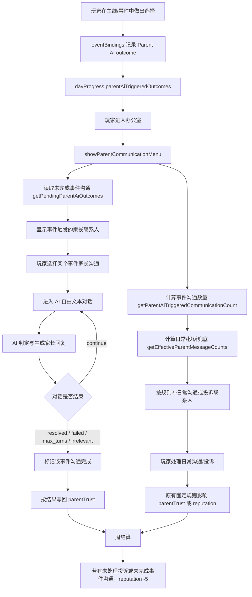

---

## 3. 本周家长联系人数量规则

这部分在 `src/core/ParentTrustSystem.js` 的 `getEffectiveParentMessageCounts(parentTrust, eventCommunicationCount)`。

事件触发沟通优先级高于日常/投诉兜底。

| 本周事件触发沟通数 | parentTrust | 日常沟通 | 投诉 |
|---:|---:|---:|---:|
| >= 2 | 任意 | 0 | 0 |
| 1 | >= 50 | 1 | 0 |
| 1 | < 50 | 0 | 1 |
| 0 | >= 75 | 3 | 0 |
| 0 | >= 50 | 2 | 1 |
| 0 | >= 25 | 1 | 2 |
| 0 | < 25 | 0 | 3 |

也就是说：

- 如果本周已经有两个基于事件的家长沟通，就不再加日常沟通或投诉。
- 如果本周只有一个基于事件的家长沟通，就按 `parentTrust` 补一个日常沟通或投诉。
- 如果本周没有事件沟通，才完全回到原有日常/投诉数量规则。

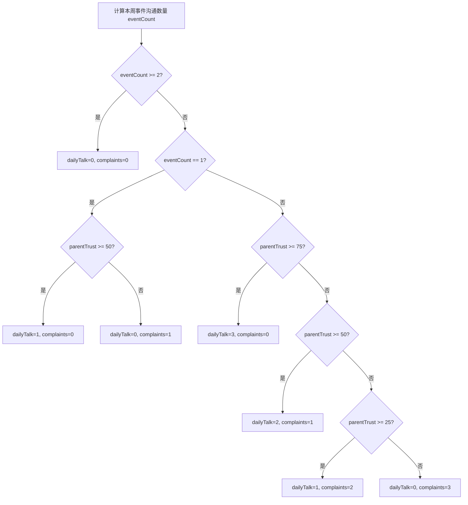

---

## 4. 事件触发沟通如何进入游戏

事件触发沟通不是凭空生成的，而是从 `dayProgress.parentAiTriggeredOutcomes` 里读。

办公室菜单里：

1. `OfficeScene._getParentAiPendingOutcomes()` 调用 `getPendingParentAiOutcomes(this.gs, { week: this.gs.day })`。
2. `getPendingParentAiOutcomes` 会：
   - 读取 `dayProgress.parentAiTriggeredOutcomes`
   - 过滤当前周
   - 过滤 `parentInitiatedEligible === true`
   - 排除已经完成的 `parentAiCompletedOutcomes`
3. `OfficeScene._getParentAiContacts()` 把每个未完成 outcome 转成联系人。
4. 玩家点进联系人后，`startParentAiEventChat(eventOutcomes)` 打开聊天框。

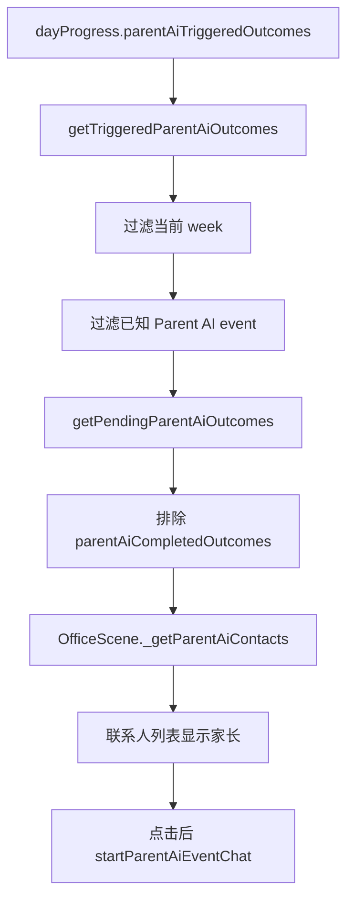

---

## 5. AI 对话 session 的结构

session 由 `parent-ai-core/session.js` 的 `createParentAiSession` 创建。

游戏里创建 session 的位置是 `OfficeScene._getParentAiSession(eventOutcomes)`。

当前参数：

```js
createParentAiSession({
  week: this.gs.day,
  eventIds,
  eventOutcomes,
  parentStyleId: 'anxious',
  trust: this.gs.parentTrust,
  maxTurns: 4,
})
```

session 里主要字段：

| 字段 | 作用 |
|---|---|
| `id` | session key，按 week、outcome、parentStyle 生成 |
| `week` | 当前周 |
| `eventIds` | 相关事件 ID |
| `eventOutcomes` | 具体玩家选项结果 |
| `parentStyleId` | 当前固定为 `anxious` |
| `maxTurns` | 当前为 4 |
| `turnCount` | 已经进行了几轮玩家回复 |
| `trust` | AI 对话内部信任轴 |
| `completedTaskIds` | 已完成的沟通任务 |
| `taskAssessments` | evaluator/aggregator 对任务完成度的判断 |
| `harmfulStreak` | 连续有害回复计数 |
| `conversationEnded` | 对话是否结束 |
| `endReason` | `continue` / `resolved` / `failed` / `max_turns` / `irrelevant` |
| `messages` | 对话历史 |

注意：session 内部的 `trust` 不是直接等于游戏全局 `parentTrust`。AI 每轮会更新 session trust；只有对话结束时，才按 `_getParentAiGameTrustDelta` 映射成游戏内 `parentTrust` 增减。

---

## 6. 事件选项如何决定初始信任

`createParentAiSession` 会调用 `parentTrustFromEventOutcomes(normalizedOutcomes, trust)`。

当前逻辑：

1. 对每个 outcome 取影响值：
   - 优先看 `choiceTrustImpact`
   - 否则看 `effects['group.trust']`
   - 否则看 `effects['group.stress']`
     - stress 下降：视为正面
     - stress 上升：视为负面
   - 都没有则为 0
2. 对 outcome 影响取平均。
3. 平均影响决定 session 信任起点：
   - 平均 > 0：anchor 62
   - 平均 < 0：anchor 38
   - 平均 = 0：anchor 50
4. 再加全局 `parentTrust` 的小幅偏移：
   - `(fallbackTrust - 50) * 0.2`
5. 最后 clamp 到 0-100。

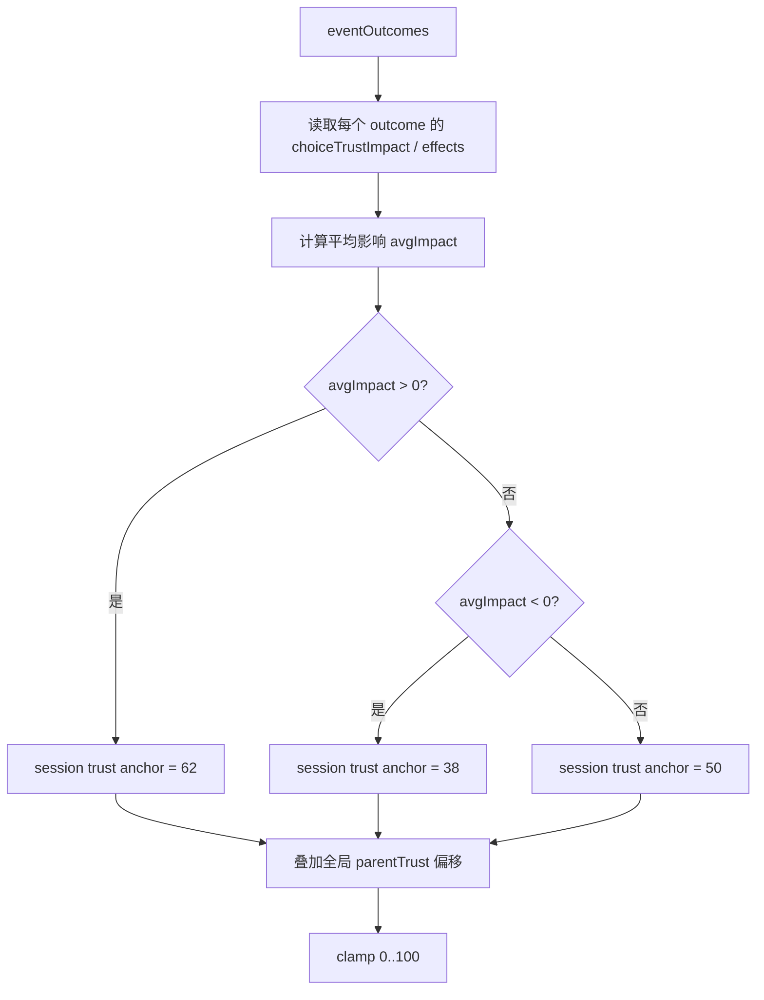

---

## 7. 玩家提交回复后的 AI 执行流程

游戏内提交位置：`OfficeScene._submitParentAiReply(session, playerReply)`。

流程：

1. 聊天框把玩家输入显示出来。
2. 记录 pending turn，避免同一个 session 重复提交。
3. 调用 `requestParentAiTurn({ session, playerReply })`。
4. API 侧构造 payload。
5. 三个 evaluator 并行评估玩家回复。
6. aggregator 汇总 evaluator 结果并生成家长可见回复。
7. 后处理：
   - 有害回复强制修正结果。
   - 正常化 score、trustDelta、任务完成状态。
   - 判断是否 `resolved` / `failed` / `continue` / `max_turns`。
   - 如果 resolved，重写成收束语气，不再生成追问。
8. 返回游戏。
9. 游戏更新 session。
10. 如果终局，则写回游戏 `parentTrust` 并标记 outcome 完成。

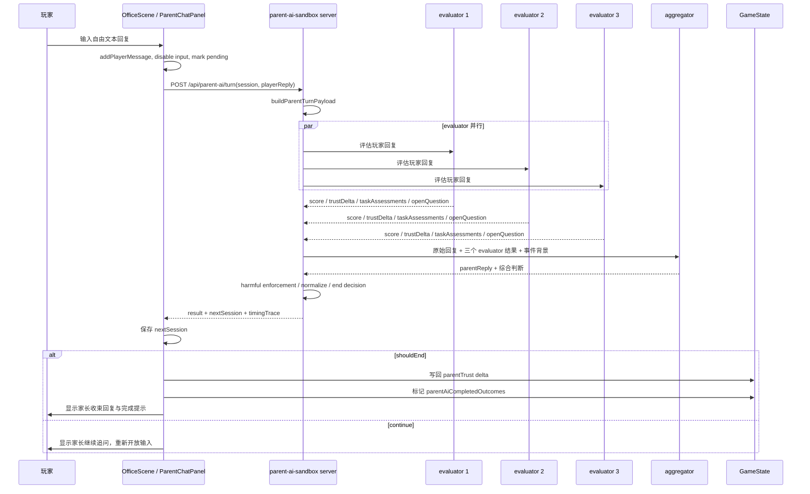

---

## 8. 三个 evaluator 和一个 aggregator 分工

实现位置：`parent-ai-core/agentEnsemble.mjs`。

### evaluator

当前是 3 个 evaluator 并行。它们的作用不是生成给玩家看的家长回复，而是评估玩家刚刚输入的回复。

每个 evaluator 输出大致包括：

| 字段 | 作用 |
|---|---|
| `score` | 本轮回复质量，0-100 |
| `trustDelta` | AI 内部信任变化，-25 到 +25 |
| `parentMood` | 家长情绪状态 |
| `taskAssessments` | 三个沟通任务分别是 `missing` / `partial` / `complete` |
| `safetyFlag` | `ok` / `concerning` / `harmful` |
| `shouldEndRecommendation` | evaluator 是否建议结束 |
| `hasSubstantiveOpenQuestion` | 家长是否还有实质疑问 |
| `oneLineReason` | 简短理由 |

当前 evaluator 的模型设置：

- provider：DeepSeek
- model：`deepseek-v4-flash`
- reasoning effort：`low`
- `maxOutputTokens`：`16384`

### aggregator

aggregator 的作用是：

1. 读取玩家原始回复。
2. 读取事件背景。
3. 读取三个 evaluator 的判定。
4. 形成最终分数、信任变化、任务完成状态。
5. 生成家长可见回复。

当前 aggregator 的模型设置：

- provider：DeepSeek
- model：`deepseek-v4-flash`
- reasoning effort：`medium`
- `maxOutputTokens`：`16384`

aggregator 当前会吃进去的关键信息包括：

| 信息 | 来源 |
|---|---|
| `currentPlayerReply` | 玩家当前这一轮原始输入 |
| `parentOpening` | 家长第一句话 |
| `questionFocus` | 家长这一轮真正想问什么 |
| `parentKnownFacts` | 家长实际知道的事实 |
| `parentInterpretation` | 家长自己的理解/误解 |
| `actualRelationship` | 事件真实因果关系 |
| `selectedOutcomeSummary` | 玩家选项结果摘要 |
| `originalPayload` | 完整 turn payload |
| `preliminaryConsensus` | 三个 evaluator 的初步共识 |
| `evaluatorResults` | 三个 evaluator 的完整输出 |

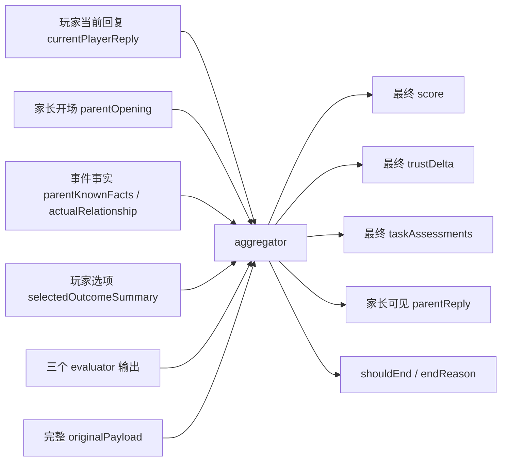

---

## 9. 三个沟通任务

当前不是固定四轮，而是按任务完成度和信任轴判断是否可以提前结束。

任务结构在 `parent-ai-core/data.js` 里定义，并通过 `buildParentTurnPayload` 传给模型。

当前核心任务是：

| taskId | 游戏内含义 |
|---|---|
| `emotional_facts` | 共情家长担忧，并说明当天事实 |
| `professional_reframe` | 用专业但可理解的方式解释为什么这样做 |
| `action_partnership` | 说明下一步如何协作，家庭端是否需要配合 |

这里的任务不是强制清单，不是家长来稽核老师有没有逐项完成。它只是 AI 判定回复质量的辅助结构。实际结束条件由信任轴、疑问是否已经解决、任务完成度共同决定。

---

## 10. 对话结束判定

对话结束主要在 `agentEnsemble.mjs` 的 `normalizeAgentResult` 后处理中决定。

当前可见的结束类型：

| endReason | 含义 | 是否写回游戏 parentTrust |
|---|---|---|
| `continue` | 继续聊，本轮不结算游戏信任 | 否 |
| `resolved` | 家长已经基本信任并接受说明 | 是 |
| `failed` | 沟通失败，或有害回复达到失败条件 | 是 |
| `max_turns` | 达到最大轮数仍未解决 | 是 |
| `irrelevant` | 回复明显偏题 | 是 |

当前 `maxTurns` 是 4。这只是兜底，不代表一定要聊满 4 轮。

### resolved 的大致逻辑

满足核心沟通条件后，如果信任和疑问状态足够好，可以结束。

当前核心条件包括：

- `emotional_facts` 完成，并且 `professional_reframe` 完成；或
- `professional_reframe` 完成，`emotional_facts` 部分完成，且分数足够高。

然后结合以下信任条件：

- 没有实质未解疑问，且 projected trust 足够高；或
- projected trust 已经高到足以结束；或
- 本轮 `trustDelta` 很高，说明家长信任明显上升。

### failed 的大致逻辑

失败主要来自：

- harmful 回复连续出现；
- projected trust 掉到很低；
- trust 低且本轮 trustDelta 很负。

### resolved 后家长回复

如果最终判定为 `resolved`，系统会调用 `buildResolvedParentReplyByQuality`，强制把家长回复改成收束语气。

这意味着 resolved 的回复理论上不应该再出现新的实质追问。如果出现“shouldEnd=true 但家长还在追问”，那就是需要继续修正的 bug。

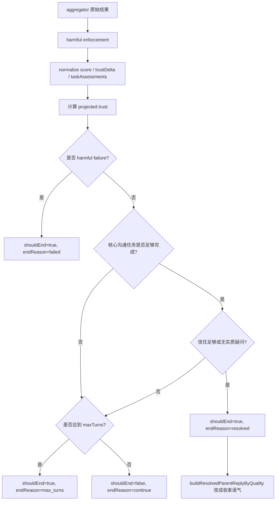

---

## 11. 游戏数值写回规则

### 事件 AI 沟通

事件 AI 沟通不会每轮直接改游戏 `parentTrust`。只有对话结束时，`OfficeScene._getParentAiGameTrustDelta(result, sessionBefore)` 会把 AI 的分数和信任变化映射成游戏数值。

当前规则：

| AI 结果 | 条件 | 游戏 parentTrust 变化 |
|---|---|---:|
| 高品质 resolved | `score >= 82` 或 `trustDelta >= 10` 或 `trustAfter >= 72` | +4 |
| 普通 resolved | 不属于高品质，也不属于勉强 | +2 |
| 勉强 resolved | `score < 68` 且 `trustDelta < 6` | +1 |
| continue | 对话还没结束 | 0 |
| failed harmful | `endReason=failed` 且 `safetyFlag=harmful` | -8 |
| failed non-harmful | `endReason=failed` | -6 |
| max_turns | 达到最大轮数仍没解决 | -4 |
| irrelevant | 明显偏题 | -4 |

### 未完成事件沟通

如果玩家没有完成事件沟通就进入周结算：

- 该对话本身不写回 `parentTrust`。
- 但周结算会把它视为“有未完成家长沟通”，造成 `reputation -5`。

### 原有日常沟通/投诉

位置：`OfficeScene.processParentMessages` 和 `OfficeScene.processSingleParentMessage`。

当前规则：

| 类型 | 处理好 | 处理差 |
|---|---:|---:|
| 日常沟通 | `reputation +1` | `parentTrust -2` |
| 投诉 | `parentTrust +4` | `reputation -3` |

周结算时，如果有未处理投诉或未完成事件沟通：

- `reputation -5`

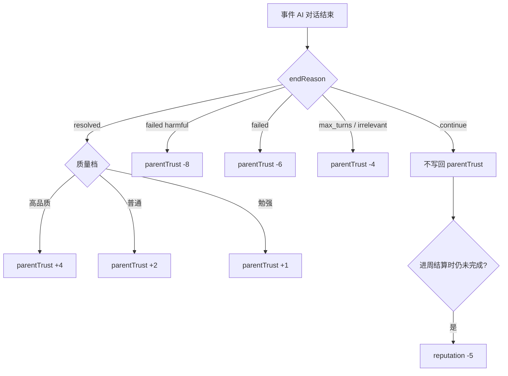

---

## 12. 等待 AI 时能否离开聊天框

当前 `OfficeScene._submitParentAiReply` 会：

- 提交后禁用当前输入框；
- 但保持 `chat.setCloseEnabled(true)`；
- 也就是说玩家可以离开当前聊天框去做别的事。

如果 AI 返回时玩家已经离开：

1. 代码仍会保存 `nextSession`。
2. 如果该轮已经终局，仍会写回游戏 `parentTrust` 并标记完成。
3. 但不会强行把回复插到已经关闭/切走的聊天 UI 里。

---

## 13. 周结算逻辑

位置：`src/scenes/ResultScene.js`。

结算时会检查：

1. 是否有未处理的原有投诉；
2. 是否有未完成的事件 AI 家长沟通。

如果任一存在：

- `reputation -5`
- `evaluateDayEnd(this.gs, hasUnhandledComplaint || hasUnhandledParentAiCommunication)`

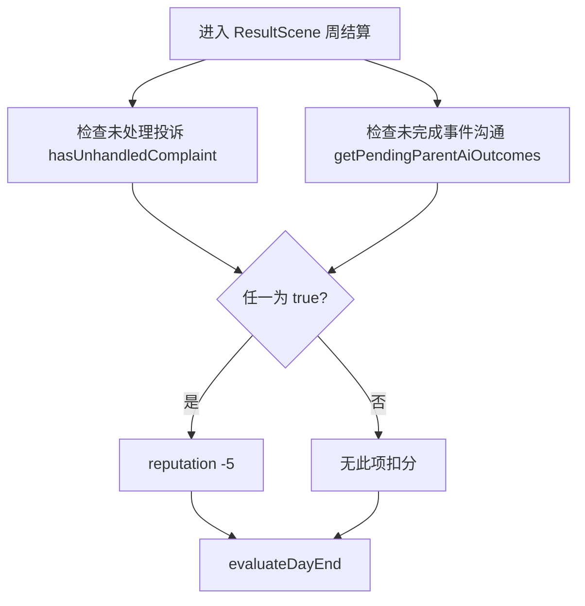

---

## 14. 32 个事件选项对应的家长第一句话

这些第一句话存放在：

`parent-ai-core/parentCommunicationPremises.js`

字段名：

`parentFirstMessage`

注意：这些是为家长沟通系统新增的事件后续沟通文案，不是原剧情文件里的原文。

### 第 1 周

#### 1. 小明的小恐龙：统一收纳后放回原处

- outcomeId：`xiaoming_dinosaur:uniform_storage_then_restore`
- 家长第一句话：

> 老师，小明今天回家后一直在检查几样东西是不是还放在原来的位置，我挪了一件，他马上又放回去，还确认了好几次。照护所今天是不是动过他平时固定放的东西？

#### 2. 小明的小恐龙：先询问小明意愿

- outcomeId：`xiaoming_dinosaur:ask_xiaoming_first`
- 家长第一句话：

> 老师，今晚整理玩具时，小明先看我，再指了指他平常放东西的位置，等我确认不动以后才继续。你们今天是不是也先问了他的意思？这种做法我们在家要不要保持一致？

#### 3. 小明的小恐龙：标注固定位置

- outcomeId：`xiaoming_dinosaur:label_fixed_position`
- 家长第一句话：

> 老师，我在今天的活动照片里看到架子上贴了“小明的小恐龙”。这个固定格主要是为了让他更容易确认位置吗？家里也需要做类似标记吗？

#### 4. 小丽走进阳光：过快引导进阳光

- outcomeId：`xiaoli_sunlight:too_fast_sunlight_attempt`
- 家长第一句话：

> 老师，小丽今天一走到门口有太阳的地方就停下来挡眼，绕到阴影里才肯继续。她白天户外活动时是不是也对光线很不舒服？当时有带她往亮处走吗？

#### 5. 小丽走进阳光：阴影到阳光的过渡区

- outcomeId：`xiaoli_sunlight:shade_to_light_transition`
- 家长第一句话：

> 老师，小丽今晚没有像以前那样一开阳台门就退回去，而是把凳子拖到窗帘影子边上才坐下。我本来以为她没那么怕光了，但她还是没有往最亮的地方走。你们今天户外活动是不是换了什么做法？

#### 6. 小丽走进阳光：所有孩子都移到树荫下

- outcomeId：`xiaoli_sunlight:move_everyone_to_shade`
- 家长第一句话：

> 老师，我看今天的照片里所有孩子都到树荫下活动了。是因为小丽不舒服才把大家都移过去的吗？我担心这样会不会让她显得像是影响了其他孩子。

### 第 2 周

#### 7. 玩具偏好：一次提供多种材质

- outcomeId：`week2_toy_preference:multiple_textures_at_once`
- 家长第一句话：

> 老师，孩子今天回家碰了一下我新买的软胶玩具就马上推开，又回去摸那几块磨砂积木。白天玩具室是不是一次拿了好几种不同手感的玩具给他？会不会变化有点多？

#### 8. 玩具偏好：跟随熟悉材质

- outcomeId：`week2_toy_preference:follow_familiar_texture`
- 家长第一句话：

> 老师，今晚我没催他换玩具，只在旁边拿了一块同样的磨砂积木。他后来把自己的积木往我这边挪了一点。你们今天是不是也先陪着他玩同一种积木，没有催他换？

#### 9. 玩具偏好：使用声音玩具吸引

- outcomeId：`week2_toy_preference:use_sound_toy`
- 家长第一句话：

> 老师，孩子今天回家一听到发声玩具就马上按掉，之后还在架子前来回走。玩具室白天是不是也用过声音玩具吸引他？他当时有没有表现得不舒服？

#### 10. 沙坑互动：要求口头轮流报数

- outcomeId：`week2_sand_play:verbal_turn_taking`
- 家长第一句话：

> 老师，孩子放学后本来想去沙坑，我一说“要不要轮流数数”，他马上就走开了。今天沙坑活动是不是也要求他们开口报数？他当时有没有因此停下来？

#### 11. 沙坑互动：用胶带划分边界

- outcomeId：`week2_sand_play:tape_boundary`
- 家长第一句话：

> 老师，孩子今晚做手工前先拿胶带把桌子分成两边，我一开始还担心他是不是更不愿意分享了。可是后来他会把共用的胶水沿着胶带推给家里人，两个人反而没抢。你们今天是不是也用过这种边界？

#### 12. 沙坑互动：大人代替完成

- outcomeId：`week2_sand_play:adult_completes_for_child`
- 家长第一句话：

> 老师，今晚我一伸手帮他搭积木，他就退到旁边，只看我做，自己不再碰了。今天沙坑活动里是不是也有大人帮得比较多？他当时是不是也退出了？

### 第 3 周

#### 13. 绘本情绪：高唤起故事情节

- outcomeId：`week3_picture_book_emotion:high_arousal_story`
- 家长第一句话：

> 老师，今晚故事一讲到紧张的地方、声音稍微大一点，他就捂住耳朵往后缩，还把书推开了。今天绘本活动是不是也读了比较刺激的内容？

#### 14. 绘本情绪：重复句式节奏

- outcomeId：`week3_picture_book_emotion:repetitive_sentence_rhythm`
- 家长第一句话：

> 老师，孩子今晚自己拿了那本句子会重复的绘本，每读到重复的那一句就翻页，后来整本都听完了。你们今天讲故事时是不是也用了这种一句一句重复的节奏？

#### 15. 绘本情绪：一次给太多选择

- outcomeId：`week3_picture_book_emotion:too_many_book_choices`
- 家长第一句话：

> 老师，我今晚把一排八本书都拿出来让孩子自己选，他看了很久，最后全推开了。我有点怀疑是不是让他选反而更累，直接替他决定会不会好一点？你们今天让孩子选书时是怎么给选项的？

#### 16. 结构化运动：高强度先行

- outcomeId：`week3_structured_movement:high_intensity_first`
- 家长第一句话：

> 老师，孩子今天离开后还是一直快速跑跳，回家以后，从玩到洗手、吃饭都很难停下来。今天感统活动是不是前面强度很高，结束前没有慢慢降下来？

#### 17. 结构化运动：先低后高再降速

- outcomeId：`week3_structured_movement:low_high_low_sequence`
- 家长第一句话：

> 老师，孩子今天穿鞋、出门都挺顺，晚上散步时还先慢慢走、后来自己跳了几下。我本来还在想，是不是白天运动量不够，所以晚上还有这么多力气。你们今天感统活动的强度是怎么安排的？

#### 18. 结构化运动：分组但监督不足

- outcomeId：`week3_structured_movement:split_groups_insufficient_supervision`
- 家长第一句话：

> 老师，我看到今天感统活动分成了两个不同节奏的小组。我家孩子做起运动来，有时顾不上听远处的提醒。当时每组都有老师一直看着吗？两边同时进行时，你们怎么分工？

### 第 4 周

#### 19. 作品展示：未经再次确认就列入展示

- outcomeId：`week4_showcase_consent:add_without_reconfirming`
- 家长第一句话：

> 老师，我今晚一说“这张画可以给别人看”，孩子马上把画翻过去，还把下一张纸收起来了。今天照护所是不是讨论过要展示他的作品？现在作品还只是在内部挑选，还是已经列进对外清单了？

#### 20. 作品展示：让孩子预览和点头确认

- outcomeId：`week4_showcase_consent:preview_and_child_assent`
- 家长第一句话：

> 老师，预览里这张画是他白天点头愿意展示的，可我今晚再问时，他又把同一张画翻过去压住了。我不知道该听哪一次，也担心他只是反复。现在是不是应该先把这张撤下来，再重新确认？

#### 21. 作品展示：分项征得同意

- outcomeId：`week4_showcase_consent:separate_consent_items`
- 家长第一句话：

> 老师，我收到那份“内部确认”的展示预览了，作品、照片、姓名和说明是分开列的。是不是每一项都要分别确认，最终对外之前还会再让我们核对一次？

#### 22. 集体互动：统一排队规则

- outcomeId：`week4_group_interaction:single_queue_rule`
- 家长第一句话：

> 老师，孩子今晚一听到“排队、等轮到你”就整个人僵住，一直低声抗议，但又没有离开桌边。今天集体活动是不是也让他们排队等彩笔？现场是不是很挤？

#### 23. 集体互动：分散材料

- outcomeId：`week4_group_interaction:distributed_materials`
- 家长第一句话：

> 老师，孩子今晚先把一盒彩笔分成两小盒，放到桌子两边。我一开始担心他是在躲着家里人、不愿意共用，可两个人后来一直在同一张桌上画，也没抢笔。把材料分开到底算回避，还是反而能帮他们一起做完？

#### 24. 集体互动：只带离一个孩子

- outcomeId：`week4_group_interaction:remove_one_child_only`
- 家长第一句话：

> 老师，孩子今晚和家里人共用彩笔时一直把整盒彩笔护在身前，对方走开以后他还盯着看了很久。今天桌边是不是发生过争抢？现场后来是怎么处理的，材料或位置有没有调整？

### 第 5 周

#### 25. 拼图支持：直接给答案

- outcomeId：`week5_scaffolded_problem_solving:give_direct_answer`
- 家长第一句话：

> 老师，今晚拼图卡住时我直接告诉他放哪里，他放好以后看了一眼就走了，也没再试下一块。今天你们拼图时是不是也直接指出了答案？会不会帮得太快了？

#### 26. 拼图支持：给少量提示

- outcomeId：`week5_scaffolded_problem_solving:graded_prompt`
- 家长第一句话：

> 老师，孩子今晚搭轨道时，我一伸手替他扣上接头，他马上把我的手推开。我还以为他开始什么帮助都不要了，可后来我只把两个纹路一样的接头摆出来，他又愿意继续试。你们今天拼图时是怎么拿捏提示多少的？

#### 27. 拼图支持：转动拼图角度

- outcomeId：`week5_scaffolded_problem_solving:rotate_puzzle`
- 家长第一句话：

> 老师，孩子今晚拼图卡住以后，自己把底板转了个方向，停了一会儿又找到能接上的一块。你们今天是不是也用过“换个方向看”的办法？

### 第 6 周

#### 28. 进食支持：分开混到的食物

- outcomeId：`week6_food_mixing:separate_mixed_parts`
- 家长第一句话：

> 老师，我洗餐盒时看到沾到青菜汁的那一小块饭被单独分在旁边，其他米饭吃了一些。你们今天是不是只把混到的部分分开以后，他才开始吃？家里以后也先这样分开摆吗？

#### 29. 进食支持：只问孩子想吃什么

- outcomeId：`week6_food_mixing:ask_preference_only`
- 家长第一句话：

> 老师，今天餐盒里的饭菜混在一起，几乎都没动。晚上我问小宇想先吃哪一种，他也只是看着碗，没有回答。白天是不是也只问他想吃什么、然后一直等？会不会真正卡住他的是食物已经混了？

### 第 7 周

#### 30. 最终观察：只记录可见变化

- outcomeId：`week7_final_observation:record_only_visible_changes`
- 家长第一句话：

> 老师，我看这周的观察摘要里，孩子只有一句“状态稳定”，没有写他参加了什么、什么时候停下来，或者什么帮助对他有用。是不是因为他比较安静，就没有被具体记录到？

#### 31. 最终观察：记录情境触发因素

- outcomeId：`week7_final_observation:record_context_triggers`
- 家长第一句话：

> 老师，我看到摘要里写他会先站在边上看，等固定位置空出来才坐下，这和我们在家看到的很像。这条观察接下来会怎么用？我还需要补充家里的哪些情况？

#### 32. 最终观察：和家庭记录交叉验证

- outcomeId：`week7_final_observation:cross_check_home_records`
- 家长第一句话：

> 老师，这次摘要第一次写到声音变大时他会退到门边。我翻了家里的记录，最近几次比较烦躁的晚上大多也是吵闹活动之后，可也有一次完全没事。现在能说主要就是声音造成的吗，还是还要把哪些情况一起记下来？

---

## 15. 32 条开场文案在代码里如何被使用

`parentCommunicationPremises.js` 不是只保存第一句话，还会把 premise 合并进 outcome。

流程大致是：

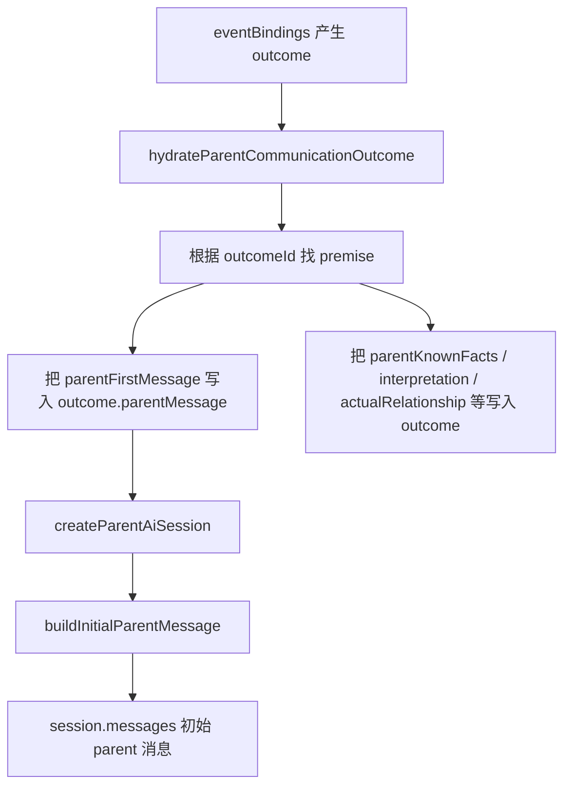

也就是说：

- 联系人预览会优先用 `outcome.parentMessage`。
- 聊天打开后的第一条家长消息来自同一条 premise 的 `parentFirstMessage`。
- 后续 AI 判定和回复生成也会读取同一条 premise 的事实边界，不应该只凭第一句话自由发挥。

---

## 16. 当前系统的几个重要边界

### 不是“家长核对清单”

三项沟通任务只是判定辅助。目标不是让家长逐项检查老师有没有完成任务，而是让家长在事件后的不确定、担忧或误解中，逐步建立“老师理解孩子、处理方式可靠、后续可以配合”的信任。

### 不是每次都要四轮

`maxTurns = 4` 是兜底。理想情况是：

- 玩家第一轮已经解释清楚、共情到位、边界合理，则可以直接 `resolved`。
- 玩家说得部分清楚，但家长仍有实质疑问，则 `continue`。
- 玩家持续有害、否定孩子、推卸责任，可能 `failed`。

### resolved 后不应该继续追问

如果 `shouldEnd=true` 且 `endReason=resolved`，家长回复应该是收束语气，比如表示理解、愿意配合、后续继续观察，而不是继续提出新的核心问题。

### continue 不参与周结算写回

`continue` 只是“这轮还没结束”。如果玩家之后没有继续完成，进入周结算时不是用 `continue` 写回 `parentTrust`，而是作为“未完成事件沟通”触发声誉扣分。

---

## 17. 调试与追踪

### API 调用耗时

`evaluateParentTurnWithAgents` 会返回 `timingTrace`。

其中包括：

| 字段 | 含义 |
|---|---|
| `totalDurationMs` | 整轮 AI 总耗时 |
| `provider` | 当前 provider |
| `model` | 当前模型 |
| `topicId` | 当前事件话题 |
| `choiceId` | 当前选项 |
| `turnCountBefore` | 本轮前已有回合数 |
| `trustBefore` | 本轮前 session trust |
| `trustDelta` | 本轮 AI 内部信任变化 |
| `trustAfter` | 本轮后 session trust |
| `shouldEnd` | 是否结束 |
| `endReason` | 结束原因 |
| `stages` | 三个 evaluator 和 aggregator 各自耗时 |
| `evaluators` | 三个 evaluator 的关键判定 |

本地 trace 文件：

- `tmp/parent-ai-traces.jsonl`

这里应记录实际 `/api/parent-ai/turn` 调用的耗时和判定，用来还原每一轮“甘特图”、信任变化、是否结束。

### 甘特图读法

一次 AI 回复通常是：

```mermaid
gantt
  title 单轮 AI 调用结构
  dateFormat X
  axisFormat %L
  section Evaluators
  evaluator 1 low :0, 6
  evaluator 2 low :0, 12
  evaluator 3 low :0, 11
  section Aggregator
  aggregator medium :12, 13
```

含义：

- 三个 evaluator 基本同时开始。
- aggregator 必须等三个 evaluator 都结束后才能开始。
- 总耗时约等于“最慢 evaluator 耗时 + aggregator 耗时 + 少量网络/处理开销”。

---

## 18. 当前实现的核心风险点

### 1. 文案事实边界必须持续校验

32 条 `parentFirstMessage` 和对应 premise 是新增沟通背景，不是原剧情原文。它们必须和原剧情事件、玩家选项、家长可得信息来源保持一致。

尤其要避免：

- 家长知道了他不可能知道的现场细节；
- 孩子回家后表现被写成不合理的“照护所场景镜像”；
- 把 ASD 儿童写成分不清场景；
- 用不自然或有歧义的成人表达。

### 2. resolved 回复不能再追问

这点已经通过 `buildResolvedParentReplyByQuality` 做了收束处理，但仍需要实测确认。

### 3. aggregator 必须读到玩家原始回复

当前 aggregator payload 已显式包含 `currentPlayerReply`。如果未来重构时漏掉，家长回复会只根据 evaluator 摘要生成，容易出现“没听懂玩家具体说了什么”的问题。

### 4. 游戏数值和 AI 内部信任是两层

AI 的 `trustDelta` 范围是 -25 到 +25，但游戏写回被压缩成小幅变化：

- resolved：+1 / +2 / +4
- failed：-6 / -8
- max_turns / irrelevant：-4

这样做是为了让支线沟通有影响，但不至于压过主线经营数值。

---

## 19. 一句话版本

当前系统是：玩家每周事件选择会生成最多若干个“基于事件的家长沟通”；这些沟通优先占用家长沟通名额，不足时才用日常/投诉兜底；事件沟通由 3 个 evaluator 和 1 个 aggregator 判断玩家自由文本回复，并在家长信任轴上决定继续、解决或失败；只有对话终局时才把结果压缩写回游戏 `parentTrust`，未完成则在周结算扣 `reputation`。
